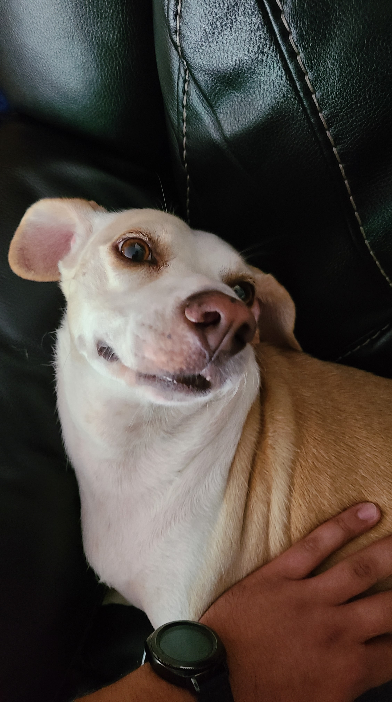
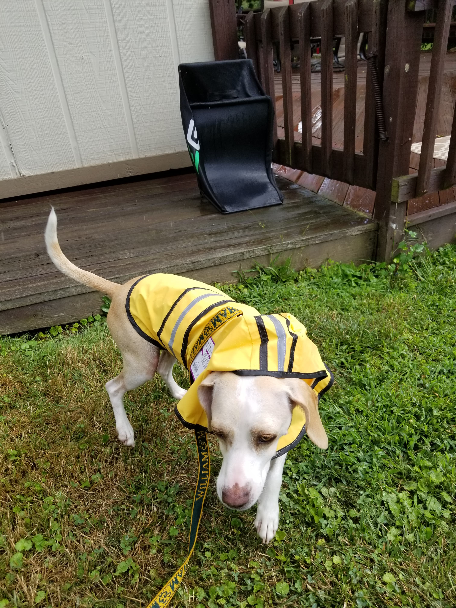
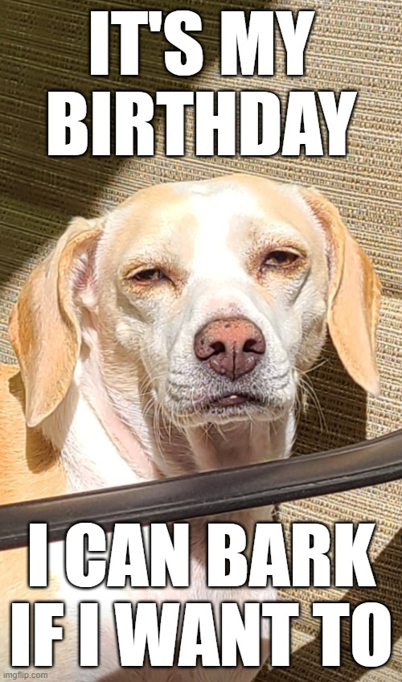

## Happy Barkday!

----------------------------------

    
    
    

My dog Ada and I are turning about the same age this year, so it felt like a good excuse to throw a party!

I've reserved a picnic shelter at Black Hill Regional Park, and I'll provide food and drinks and such (alcohol is not allowed at this type of picnic shelter, womp womp).  There's also a dog park close to the picnic areas, so we can take the doggos to play in there if there's enough demand!

## Event information
----------------------------------

| |     |
| :---:        |    :----   |
| What | Ada's bday picnic |
| When | Saturday, July 17th, 1 pm to 5 pm |
| Where| Black Hill Regional Park, Picnic Shelter H |
| Links | [Park website](https://www.montgomeryparks.org/parks-and-trails/black-hill-regional-park/), [Picnic Shelter Map](https://www.montgomeryparks.org/resources/black-hill-regional-park-picnic-shelter-map/), [Google Maps to picnic shelter](https://goo.gl/maps/DTmQSrPd8toy8eRC6)|

## Pictures of Ada!
----------------------------------

- [Ada pics](https://mayankles.github.io/ada-picnic-party/slideshow.html)

